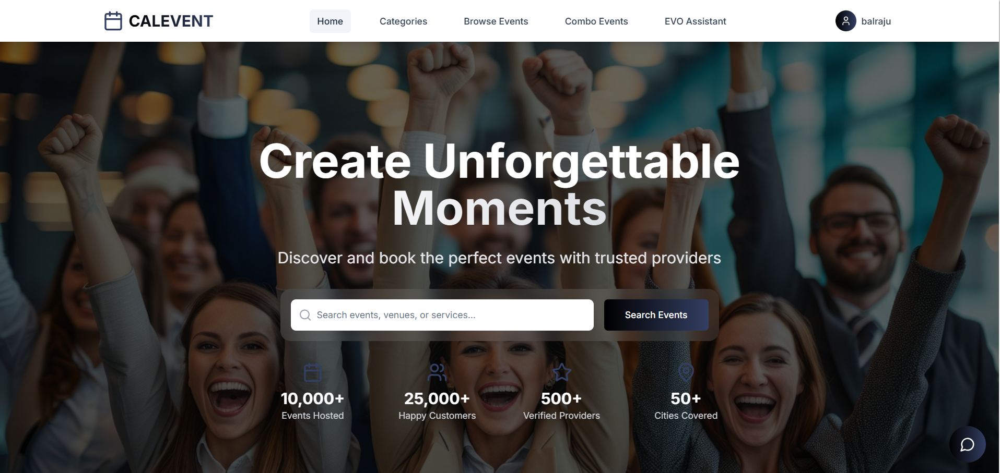

# CALEVENT - Next-Gen AI-Powered Event Booking Platform 🚀🤖

<div align="center">
  
  
  <p><strong>Redefining the event industry with Multi-Tier AI, seamless UX, and hyper-premium architecture.</strong></p>
  
  > **Live Demo:** [https://calevent-buildathon.onrender.com](https://calevent-buildathon.onrender.com)
</div>

---

CALEVENT is an enterprise-grade, full-stack event booking platform engineered to bridge the gap between event organizers (providers) and customers seamlessly. What sets CALEVENT apart is its **deeply integrated, state-of-the-art Multi-Tier Artificial Intelligence System**, designed to act as an autonomous event planner, intelligent concierge, and dynamic data analyzer.

Built with massive scalability in mind, CALEVENT brings the ultimate modern aesthetic, utilizing Framer Motion animations, complex React architectures, secure role-based access control, and real-time AI processing capabilities.

---

## 🧠 The AI Engine: Multi-Tier Intelligence Architecture

CALEVENT runs on a highly sophisticated **Multi-Tier AI Fallback System**, guaranteeing 99.9% uptime for AI operations, smart-routing for cost optimization, and unparalleled user experience.

It does not rely on a single model; instead, it orchestrates multiple AI brains:

- 🟢 **Tier 1 (Primary):** **OpenAI (GPT-4o / DALL·E 3 / Vision)** - Handles complex reasoning, hyper-realistic image generation, and deep conversational context.
- 🟡 **Tier 2 (Fallback):** **Google Gemini (1.5-Flash / Vision)** - Automatically takes over routing if Tier 1 hits quota or latency issues, offering lightning-fast processing.
- 🟠 **Tier 3 (Edge Fallback):** **Hugging Face (DialoGPT / Stable Diffusion)** - Open-source edge models ensure the platform's AI never goes completely offline.
- 🔴 **Tier 4 (Failsafe):** **Deterministic Context Engine** - Fallback structured responses for network emergencies.

### 🌟 Deep AI Features

1.  **AI Event Chatbot & Concierge:** A conversational agent that understands natural language to recommend the perfect wedding planners, corporate venues, or party DJs based on exact criteria.
2.  **Autonomous Visual Intelligence (AI Image Analysis):** Providers can upload portfolio images, and the AI Vision system will automatically read, tag, and categorize the setting.
3.  **Generative AI Imagery:** Customers seeking inspiration can prompt the platform to generate mood boards or event layouts using text-to-image AI pipelines.

---

## ✨ Core Platform Features

### 🤵 Customer Portal

- **Intelligent Discovery:** Explore a curated database of premium event providers.
- **Frictionless Booking:** Secure checkout flows integrated deeply with Razorpay.
- **AI Planning Assistant:** Use the AI Chatbot to plan itineraries, draft invitations, or find specific event aesthetics.
- **Dashboard & Analytics:** Track upcoming events, manage payments, and maintain favorite lists.

### 🏢 Provider Portal

- **Business Management:** Create hyper-premium public profiles to showcase portfolios.
- **Dynamic Analytics Dashboard:** Visualized tracking for revenue generation, booking statistics, customer reviews, and profile reach.
- **Secure Ecosystem:** To maintain high marketplace quality, newly registered businesses require Super Admin verification before activating.
- **Messaging System:** Direct client-to-provider inbox integration contextually linked to upcoming bookings.

### 🛡️ Super Admin Control Center

- **Application Auditing:** Review, approve, or reject new provider businesses trying to join the marketplace.
- **Global Telemetry & Analytics:** Comprehensive views of total user metrics, accumulated revenue, and active bookings across the entire platform.
- **User Management & Moderation:** Full control to audit, suspend, or activate customers and providers.

---

## 💻 Elite Tech Stack

**Frontend Framework & UX:**

- **Core:** React 19 (Vite)
- **Aesthetics & CSS:** Tailwind CSS, Styled Components, Tailwind Variants
- **Dynamic Motion:** Framer Motion, Anime.js, Tailwind-Animate
- **State & Routing:** Zustand / Context API, React Router v7, React Hook Form
- **Maps & Integrations:** React Leaflet, Lucide Icons, Material UI (MUI)

**Backend Architecture:**

- **Runtime:** Node.js, Express.js (RESTful architecture)
- **Database:** MongoDB via Mongoose (Complex aggregations)
- **Authentication & Security:** JWT (JSON Web Tokens), Bcrypt.js, Helmet.js
- **AI Integrations:** Google Generative AI SDK, OpenAI SDK, Hugging Face Hub
- **Payments & Infrastructure:** Razorpay SDK, Multer (File Handling), Nodemailer (Automated Email Pipelines)

---

## 🚀 Getting Started (Local Development)

### Prerequisites

Make sure you have [Node.js](https://nodejs.org/) and [MongoDB](https://www.mongodb.com/) installed on your local machine.

### 1. Clone the Repository

```bash
git clone https://github.com/yourusername/calevent.git
cd calevent
```

### 2. Backend Setup

```bash
cd calevent-backend
npm install
```

Create a `.env` file inside `calevent-backend` and add your required keys (AI keys are highly recommended to unleash the full power of the platform):

```env
PORT=5000
MONGO_URI=your_mongodb_connection_string
JWT_SECRET=your_jwt_secret

# AI Models
OPENAI_API_KEY=your_openai_api_key
GOOGLE_API_KEY=your_gemini_api_key

# Payments & Comms
RAZORPAY_KEY_ID=your_razorpay_key
RAZORPAY_KEY_SECRET=your_razorpay_secret
EMAIL_USER=your_smtp_email
EMAIL_PASS=your_smtp_password
```

Start the backend server:

```bash
# Seed the default admin so you can approve providers
node seed-admin.js

# Start development server
npm run dev
```

### 3. Frontend Setup

Open a new terminal window in the root directory:

```bash
npm install
npm run dev
```

The application will smoothly launch on `http://localhost:5173/`

---

## 🔐 Authentication & Security Workflow

CALEVENT utilizes a strict multi-tier authentication flow with no loopholes. High-level security prevents unauthorized providers from interacting with real customers.

### 👑 Super Admin Access

_(Must be seeded into the database using `node seed-admin.js` in the backend directory)_

- **URL:** `http://localhost:5173/admin/login`
- **Email:** `admin@calevent.com`
- **Password:** `admin123`

### 🏢 Provider Lifecyle Workflow

1.  **Register:** Submit hyper-detailed business credentials via the Provider Registration portal.
2.  **Pending State Lockout:** The account enters a "Pending" mode. Providers **cannot** log in yet. (Security Measure)
3.  **Admin Verification:** The Super Admin securely authenticates, reviews the application in the Dashboard, and clicks Approve/Reject.
4.  **Activation:** Once approved, the Provider gains system access and can log into `http://localhost:5173/login/provider`.

### 🤵 Customer Workflow

- Customers bypass business audits. They can register securely and log in instantly at `http://localhost:5173/login/customer`.

---

## �️ Security Implementations

- **No Token Leaks:** Fully protected routes. Registration payloads do NOT return JWTs for pending providers.
- **Encrypted Passwords:** Passwords securely hashed via `bcryptjs` before insertion into MongoDB.
- **Session State:** Stateless/Stateful sessions validated via signed JSON Web Tokens (`JWT`) expiring dynamically.
- **Protected Routes:** Entire Admin Portal guarded via custom `AdminRoute` wrappers and strict backend middleware verifying HTTP headers and database roles.

---

✨ _Engineered for the future. Scaling events through code and artificial intelligence._
